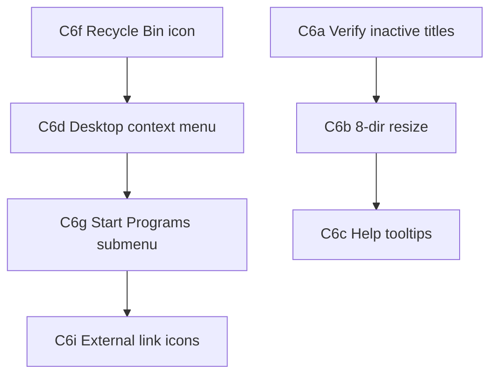

# Win98 authenticity backlog

Prioritized roadmap for making the Learning Journey desktop feel closer to classic Windows 95/98 and proven retro-portfolio patterns. **Research and planning only** — implementation is tracked as future tickets (C6+ stubs below).

## Sources

| Source | What to borrow |
|--------|----------------|
| **Classic Windows 95/98** | Start menu hierarchy, taskbar app switching, minimize-to-taskbar, modal dialogs, 3D bevel controls, inactive title bars, double-click to open, system tray clock, Explorer split-pane, Notepad for `.txt`, Shut Down cascade |
| **[retro-portfolio](https://github.com/gracemorganmaxwell/retro-portfolio)** | [`DesktopPage.tsx`](https://github.com/gracemorganmaxwell/retro-portfolio/blob/master/frontend/src/pages/DesktopPage.tsx) — icon grid, z-index window stack, minimize/focus; [`Window.tsx`](https://github.com/gracemorganmaxwell/retro-portfolio/blob/master/frontend/src/components/Window/Window.tsx) — 8-direction resize, help `?` button; [`TextWindow.tsx`](https://github.com/gracemorganmaxwell/retro-portfolio/blob/master/frontend/src/components/TextWindow/TextWindow.tsx) — Credits/Resume fetch; external-link icons; Taskbar + StartMenu |
| **Pencil / `docs/DESIGN.md`** | Artboards 02–12, interaction legend 16, vaporwave palette in `win98-tokens.css` |
| **learning-journey-os** | `ProjectsWindowContent`, `recycle_bin.png`, folder icons |

## Current state (C5 complete)

| Area | Status | Notes |
|------|--------|-------|
| Desktop shell | Done (C4a, C5b) | Monitor bezel, responsive 80%/phone modes |
| Taskbar + Start menu | Done (C4a) | Sunken active task in `Taskbar.tsx` |
| Window chrome | Done (C4b+) | `OsWindow` — active/inactive title bars, minimize/max/close |
| Shut Down | Done (C4c) | Confirm dialog → `/` |
| Blog / About / Credits | Done (C4b, C5c) | OsWindow + Notepad for `credits.txt` |
| Weather | Done (C5d) | Window (not floating widget); OpenWeather Christchurch |
| File manager | Done (C5e, C5f) | Virtual FS tree + project cards |
| Learning Log | Removed (C5a) | Superseded by focused desktop apps |

---

## Prioritized backlog

### P0 — Polish already-shipped chrome

| Feature | Status | Ticket stub | Notes |
|---------|--------|-------------|-------|
| Inactive title bar styling | **Verify** | `C6a` | Classes exist in `OsWindow.module.css` (`titleBarInactive`); audit focus changes when clicking desktop/taskbar |
| Taskbar sunken active task | **Done** | — | `Taskbar.tsx` — only one `sunken` button at a time |
| Double-click opens icons | **Done** | — | Desktop shortcuts + file manager listing |
| Minimize / restore from taskbar | **Done** | — | `useWindowManager` + taskbar buttons |
| Shut Down confirmation | **Done** | — | `ShutdownConfirmDialog.tsx` |

### P1 — High-impact authenticity (next implementation wave)

| Feature | Status | Ticket stub | Notes |
|---------|--------|-------------|-------|
| 8-direction window resize | **Missing** | `C6b` | Port pattern from retro-portfolio `Window.tsx`; clamp to monitor viewport; min size ~200×120 |
| Window help tooltips (`?` button) | **Missing** | `C6c` | Title-bar `?` opens short tooltip or “About this window” stub; retro `Window.tsx` reference |
| Right-click desktop context menu | **Missing** | `C6d` | Arrange Icons, Refresh (noop), Properties (About), optional New → shortcut stubs |
| Right-click icon context menu | **Missing** | `C6e` | Open, Explore (file manager), Delete (noop with Recycle Bin tease) |
| Recycle Bin icon (visual) | **Missing** | `C6f` | Copy `recycle_bin.png` from `-os`; desktop icon only — empty bin, no delete pipeline yet |
| Start menu Programs submenu | **Partial** | `C6g` | Flat list today; nest Blog/About/Weather/Files under “Programs” per Win98 hierarchy |
| Alt+Tab window switcher | **Missing** | `C6h` | Optional; simple modal list of open windows + z-order bump |
| External-link desktop icons | **Missing** | `C6i` | GitHub / LinkedIn shortcuts with retro “open in browser” icon overlay |
| Explorer toolbar buttons | **Partial** | `C6j` | File manager has address bar; add Back/Forward/Up icon strip (can be visual-only first) |
| Status bar object count | **Done** | — | File manager status bar |
| System tray area + clock | **Partial** | `C6k` | Taskbar shows time; add sunken tray panel styling and optional volume/network stubs |

### P2 — Delight / scope-heavy

| Feature | Status | Ticket stub | Notes |
|---------|--------|-------------|-------|
| Startup / shutdown sound | **Missing** | `C7a` | `.wav` assets; respect `prefers-reduced-motion` / mute |
| Screensaver (flying logos) | **Missing** | `C7b` | Idle timer on desktop; click to dismiss |
| Easter egg games (Solitaire, Minesweeper) | **Missing** | `C7c` | Fun but large; link externally as fallback |
| MSN Active Desktop–style widgets | **Superseded** | — | Weather is a **window** (C5d), not sidebar widget |
| Drag-and-drop icon repositioning | **Missing** | `C7d` | Grid snap; persist layout in `localStorage` |
| Window drag snap to edges | **Missing** | `C7e` | Maximize on drag-to-top (optional) |
| Marquee selection in file manager | **Missing** | `C7f` | Rubber-band select multiple icons |
| True Recycle Bin behavior | **Missing** | `C7g` | Depends on C6f; move shortcuts to bin, restore dialog |
| Pencil artboard sync | **Ongoing** | `C7h` | Regenerate `learning-journey-core.pen` when chrome changes |

---

## Recommended implementation order

**Suggested C6 epic grouping:** one commit per row in P1 (same workflow as C4/C5).

---

## retro-portfolio cross-check

| retro-portfolio pattern | lj-core today | Backlog item |
|-------------------------|---------------|--------------|
| `TextWindow` + static `.txt` | `NotepadWindowContent` + `public/credits.txt` | — (shipped C5c) |
| `ProjectsWindow` cards | File manager Projects pane | — (shipped C5f) |
| `Window` resize handles | Fixed size / maximize only | C6b |
| Help `?` on title bar | Not present | C6c |
| Context menus | Not present | C6d, C6e |
| Weather | N/A in retro | lj-core differentiator (C5d) |
| Fluid viewport clamping | Explicit 80% monitor + phone mode (C5b) | Stronger than retro |

---

## Out of scope (for now)

- Full Win32 API fidelity (real process model, file associations registry)
- Native OS integration (notifications, file system access)
- Replacing RedwoodSDK routing with in-desktop SPA only navigation

---

## How to use this doc

1. Pick the next P0 verify or P1 stub (e.g. **C6b** resize).
2. Add a section to `docs/TICKETS.md` and `.github/ISSUES.md` with acceptance criteria.
3. One issue → one commit → `Closes #N`.
